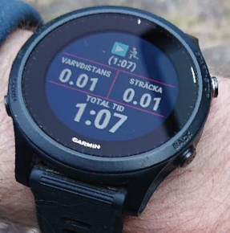

README for ControlPuncher Track preparation scripts
===================================================

Introduction to watch app
-------------------------

ControlPuncher is a watch app that acts as a virtual Orientering Control Punching system using the
GPS in the watch and a track uploaded to the watch in advance. The track needs to be preformated
using a script in this repository before uploading.

A track string may look something like this:

    CUgyMSBTdmFsbAUABQkNEgUCUzEoSV0s4qtODAMxNDYIXF0s1bRODAMxNDJgTl0sUixPDAMxNDlMJl0slhlPDAJNMeI0XSzXok4M7g==

Install ControlPuncher on the watch using ConnectIQ. Once installed the track to use is added to the
data field in the Garmin Connect app by
1.  Copy the track string to the clipboard
2.  Open Garmin connect
3.  Select the watch in the top row
4.  Select Activities, apps and more
5.  Select Data fields
6.  Select the field ControlPuncher
7.  Press Settings
8.  Clear and paste the track in the track settings field
9.  Press done in the top menu
10. Back out and synchronize the watch in Garmin Connect app to perform the actual transfer

After a run has been completed, Leg times are presented as a read only setting.

Building track strings from Livelox
-----------------------------------

Use this sparcely sinse it's hosted on my private slow 3G modem. Go to my TrackGenerator that fetches
data using Livelox service on https://helmas.se/ControlPuncher and serch for an event and generate
a track code for the track you want.

Building track strings using this repo
--------------------------------------

To run the script, python3 needs to be installed.

### Compile track xml

To convert all tracks from `track.xml` run

    python3 mkWatchStrXml.py track.xml

The track strings will be emitter to the standard output.

### Compile track.json

In order to build json tracks, run

    python3 mkWatchStrJson.py track.json

The track strings will be emitter to the standard output.

How to setup data field in watch
--------------------------------

There are two options, either copy an activity or modify an existing. Add a data field to one or more screens.
At the moment a maximum of two custom data fields can be added to an activity.

-   Edit activity
-   Edit data pages
-   Select or add a page
-   Optionally edit the layout
-   Edit data fields and select a field where the ControlPuncher shall go. Select a wide field for more information
-   Select the category ConnectIQ-fields
-   Select ControlPuncher field

Like it?
--------

Buy me a nice stout or Belgian abt beer ;)
